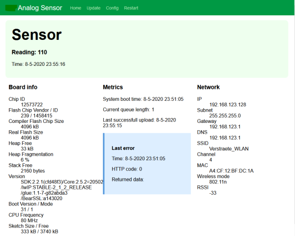
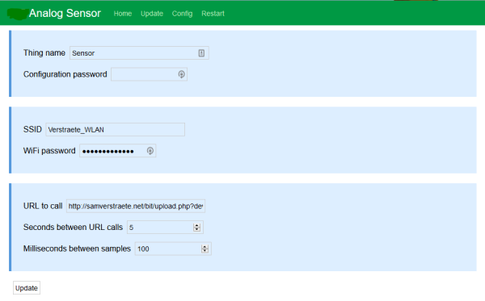

# ESP8266 WiFi Analog Sensor
> Simple analog sensor that uploads its values to a server, based on the WeMos D1 R1 (ESP8266)

## Description
When first started, the device will host an access point with captive portal. Once connected, you can setup the connecting access point and password. When it connects to an access point, the self-access point should disappear, unless you are connected to it or there is a problem with connecting to the access point. The self-access point will not come up again until it reboots.

A series of samples are taken from the analog input. The time between samples (called the shot-time in source-code) can be defined in the settings page. The minimum, mean and maximum values are then saved in a frame. The number of times a frame is uploaded is also set in the config page, you can define the time between uploads in seconds.

The device will hold a number of frames in its buffer if the upload fails. This is also displayed on the main page. The number of frames is set to 500 with the ´BUFFER_SIZE´. Since the frames aren't necessarily uploaded in real-time, the frames also hold their time as millis since startup and when uploaded, the current millis since startup is transmitted too. This way the server can calculate the original time of a frame.

It has a possibility to set up an admin password; the username is fixed to "admin". This will limit access to the configuration page and the update page; however consider it minimal security only. It will not protect against malicious attacks. 

There is a firmware reset option through the reset button. When you press the firmware reset button, when the led starts blinking, a reset window of about 10 seconds starts. When the reset button is pressed again during that time, the factory default settings are loaded the next time it boots.

The HTTPUpdateServer has also been included for remote firmware updates.

## Examples
An example PHP-script for the server side is included in the Server-directory. 

## Credits
Except for the standard ESP8266/Arduino libraries, these are used too:
- [ArduinoJson](https://github.com/bblanchon/ArduinoJson)
- [Embedded RingBufCPP](https://github.com/wizard97/Embedded_RingBuf_CPP)
- [APConfig](https://github.com/msraynsford/APConfig)

## License
"Creative Commons Attribution 3.0" license: http://creativecommons.org/licenses/by/3.0/
